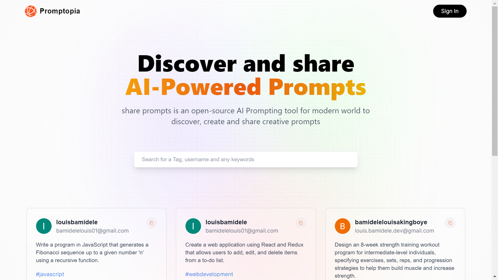

# Promptopia 

This is a tutorial challenges,  help to improve my coding skills by building realistic projects.

## Table of contents

- [Overview](#overview)
  - [The challenge](#the-challenge)
  - [Screenshot](#screenshot)
  - [Links](#links)
- [My process](#my-process)
  - [Built with](#built-with)
- [Author](#author)

## Overview

### The challenge

Users should be able to:

- add ai prompt
- create account 
- search for available prompt
- sign in and edit prompt
- see other people profile and their prompts
- View the optimal layout for the interface depending on their device's screen size
- See hover and focus states for all interactive elements on the page

  
### Screenshot

### Links

- Solution URL: [solution url](https://github.com/louis-bamidele/project7-Promptopia)
- Live Site URL: [live site](https://promptopia-share-prompt.netlify.app/)

## My process

### Built with

- next.js
- react.js
- tailwind css
- Flexbox
- grid
- Mobile-first workflow
- JavaScript

- name - 
- Frontend Mentor - [@louis7734](https://www.frontendmentor.io/profile/louis7734)
- Twitter - [@l0uis_77](https://twitter.com/l0uis_77)

